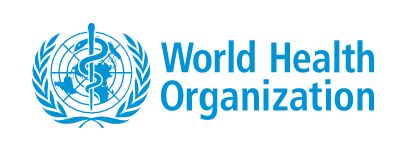

### **According to the World Health Organization, we know:**

 

#### **Key Facts about Obesity and Overweight**
- Worldwide obesity has nearly tripled since 1975.
- In 2016, more than 1.9 billion adults, 18 years and older,  - were overweight. Of these over 650 million were obese.
- 39% of adults aged 18 years and over were overweight in 2016, and 13% were obese.
- Most of the world's population live in countries where overweight and obesity kills more people than underweight.
- 38 million children under the age of 5 were overweight or obese in 2019.
- Over 340 million children and adolescents aged 5-19 were overweight or obese in 2016.
- Obesity is preventable.

#### **Causes of Obesity and Overweight**

- The fundamental cause of obesity and overweight is an energy imbalance between calories consumed and calories expended. Globally, there has been:

  - an increased intake of energy-dense foods that are high in fat and sugars; and;
  - an increase in physical inactivity due to the increasingly sedentary nature of many forms of work, changing modes of transportation, and increasing urbanization.

- Changes in dietary and physical activity patterns are often the result of environmental and societal changes associated with development and lack of supportive policies in sectors such as health, agriculture, transport, urban planning, environment, food processing, distribution, marketing, and education.

#### **Common Health Consequences**

_ Raised BMI is a major risk factor for noncommunicable diseases such as:

  - cardiovascular diseases (mainly heart disease and stroke), which were the leading cause of death in 2012;
  - diabetes;
  - musculoskeletal disorders (especially osteoarthritis – a highly disabling degenerative disease of the joints);
  - some cancers (including endometrial, breast, ovarian, prostate, liver, gallbladder, kidney, and colon).

- The risk for these noncommunicable diseases increases, with increases in BMI.

#### **Ways to Reduce Obesity and Overweight**

Overweight and obesity, as well as their related noncommunicable diseases, are largely preventable. Supportive environments and communities are fundamental in shaping people’s choices, by making the choice of healthier foods and regular physical activity the easiest choice (the choice that is the most accessible, available and affordable), and therefore preventing overweight and obesity.

At the individual level, people can:

- limit energy intake from total fats and sugars;
- increase consumption of fruit and vegetables, as well as legumes, whole grains and nuts; and
- engage in regular physical activity (60 minutes a day for children and 150 minutes spread through the week for adults).

Individual responsibility can only have its full effect where people have access to a healthy lifestyle. Therefore, at the societal level it is important to support individuals in following the recommendations above, through sustained implementation of evidence based and population based policies that make regular physical activity and healthier dietary choices available, affordable and easily accessible to everyone, particularly to the poorest individuals. An example of such a policy is a tax on sugar sweetened beverages.

The food industry can play a significant role in promoting healthy diets by:

- reducing the fat, sugar and salt content of processed foods;
ensuring that healthy and nutritious choices are available and affordable to all consumers;
- restricting marketing of foods high in sugars, salt and fats, especially those foods aimed at children and teenagers; and
- ensuring the availability of healthy food choices and supporting regular physical activity practice in the workplace.

